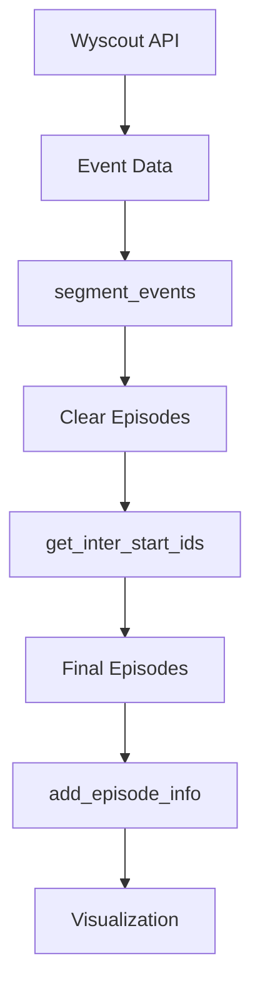

# Wyscoutイベントデータのエピソード分割システム

## 📋 概要
サッカーの試合データを意味のある「エピソード」に分割するシステム。各エピソードは連続したプレーの単位を表す。

## 🔧 システム構成

### 1. **メインコンポーネント**
- `main.py`: Streamlitアプリケーション
- `split.py`: エピソード分割のメインロジック
- `helpers.py`: インターセプト判定の補助関数
- `characterize.py`: エピソード情報の追加
- `segment.py`: セグメント分割ロジック

### 2. **エピソード分割の種類**

## 🎯 主要な実装ポイント

| 分割タイプ          | 説明                                 |
|---------------------|--------------------------------------|
| Clear Start/End     | セットプレーやボールアウトによる分割 |
| Inter Start         | プレー中のボール奪取による分割       |
| Loose Ball          | ルーズボールによる分割               |
| GK Exit Split       | GKキャッチ後のトランジション        |


### 1. **goalkeeper_exit処理**

CKからGKがキャッチ → 同チームがボール保持する場合の処理
1. goalkeeper_exitイベントを検出
2. 関連するduel（aerial_duel等）を探す
3. duel後の最初のpass/touch/carryから新エピソード開始
4. goalkeeper_exitとduelは同じエピソードに含める


### 2. スイッチング頻発の防止

```python
# 3秒ルールによる短すぎるエピソードの除外
inter_start = (
    ~df_episode["small.first"] # 最初のイベントではない
    & df_episode["long_enough"] # 3秒以上継続
    & df_episode["prev.small.episode.duration"].gt(3) # 前のエピソードも3秒以上
    & df_episode["change.team"] # チーム変更あり
    & ~df_episode["loose_ball"] # ルーズボールではない
)
```

### 3. type.secondaryのリスト形式対応

type.secondaryはリスト形式: ['forward_pass', 'loss']
- ✗ `"loss" in str(x)  # エラーになる`
- ✓ `"loss" in x       # リストに対して正しく動作`

## データフロー


## 🚨 注意点

### 1. defensive_duelの除外

50/50の状況で頻繁にチームが入れ替わるのを防ぐため除外
ただし、完全除外により重要なボール奪取を見逃す可能性あり

### 2. 時間閾値の調整

現在は3秒に設定
素早いカウンターが分割されない可能性
競技レベルやプレースタイルに応じて調整が必要

### 3. パスミス後の処理

lossタグを持つパス後のチーム変更は要注意
現在の実装では3秒ルールが適用される
より柔軟な処理が必要な場合あり

## 🎨 可視化機能

- エピソードごとのピッチ上の動きを表示
- チームカラーで識別（Urawa: 赤、Tokyo: 青）
- エピソードの詳細情報をDataFrameで表示
- クリップボードへのコピー機能

## 📈 エピソード情報

各エピソードに付与される情報：
- episode.team: 主にボールを保持したチーム
- episode.duration: エピソードの継続時間
- episode.is.transition: トランジションかどうか
- episode.is.from_loose_ball: ルーズボールから開始
- episode.is.to_loose_ball: ルーズボールで終了

## 🔍 デバッグのヒント

1. エピソードが分割されない場合
    - `inter.start`が正しく設定されているか確認
    - 3秒ルールに引っかかっていないか確認
    - `defensive_duel`が含まれていないか確認
2. エラーが発生する場合
    - `type.secondary`のデータ型を確認（リストか文字列か）
    - `pd.notna()`でNaN値の処理を確認
3. 可視化で確認
    - Streamlitアプリで各エピソードを視覚的に確認
    - 不自然な分割がないかチェック

## 📝 実装の経緯

1. 初期の問題
    - goalkeeper_exitイベント後のエピソード分割が機能しない
    - パスミス後のトランジションが認識されない
2. 改善の過程
    - goalkeeper_exit処理を追加し、関連duelを同じエピソードに含める
    - リファクタリングで関数を分割し、可読性を向上
    - type.secondaryのリスト形式に対応
3. 課題と対策
    - スイッチング頻発 → 3秒ルールを導入
    - エラー発生 → データ型の確認と適切な処理
    - 分割されない → inter.startの判定ロジックを確認

## 🚀 今後の改善案

1. パラメータの外部化
    - 時間閾値（3秒）を設定可能に
    - チームやリーグに応じた調整
2. より柔軟な分割ロジック
    - パスミス後は即座に分割
    - 明確なボール奪取は時間制限なし
3. 分析機能の追加
    - エピソードの統計情報
    - トランジションの成功率
    - チーム別の傾向分析
